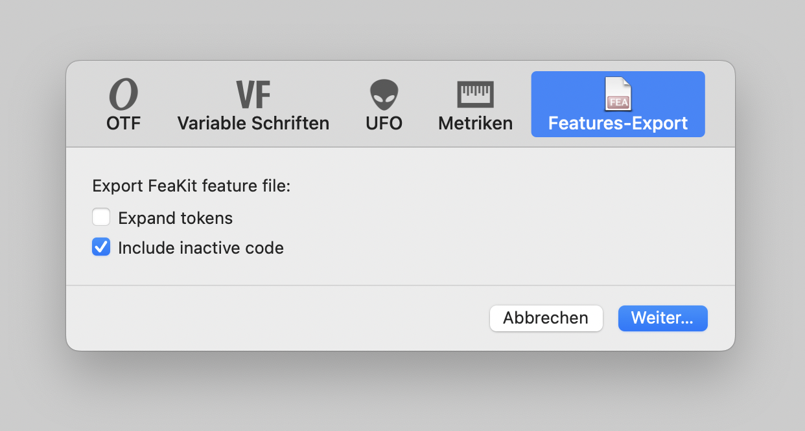

# FEAExport

Glyphs.app plug-in for exporting your font’s OpenType features.

## Installation

Install via *Window > Plugin Manager > Plugins.* Restart the app.

## Usage

1. Choose *File > Export…* (Cmd-E) and pick *FEA Export* (de: *Features-Export*) in the dialog that comes up. 
2. Pick options appropriate for you in the dialog sheet.
3. When you are done, press the *Continue…* button

## To do

- implement the *Expand Tokens* option (sorry, had no time for it yet)

## License

Copyright 2022 Rainer Erich Scheichelbauer (@mekkablue).
Based on sample code by Georg Seifert (@schriftgestalt) and Jan Gerner (@yanone).

Licensed under the Apache License, Version 2.0 (the "License");
you may not use this file except in compliance with the License.
You may obtain a copy of the License at

http://www.apache.org/licenses/LICENSE-2.0

See the License file included in this repository for further details.
